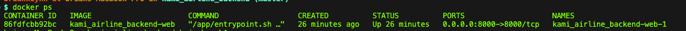
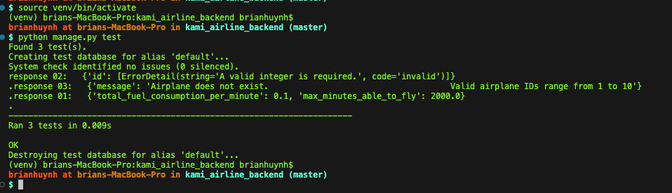
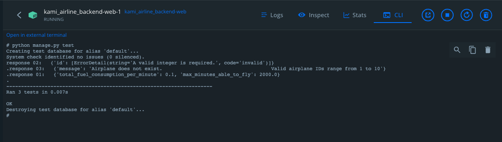

# Kami Airline Project

## Setup and Execution Instructions

  ### Step 1: Clone the Project
Clone the repository using the command:

`git clone https://github.com/brianhuynh2021/kami_airline_backend.git`

  ### Step 2: Build and Run with Docker
Execute the following command to build and start the Docker containers:

`docker compose up --build`

Verify if Docker containers are running:
`docker ps`

## Run source code manually
- First, activate virtual environment:
  If macOS: `source venv/bin/activate` or Windows: `venv\Scripts\activate`

- `pip install -r requirements.txt`
- `python manage.py runserver 0.0.0.0:8000`

## Testing the API
You can test the API using Postman

- **Postman**: Configure a new request in Postman as follows:
- URL: `localhost:8000/api/airplane/`
- Method: POST
- Body: `{"id": 1, "passengers": "17"}`
    [
        {
            "id": 1,
            "passengers": 100
        },
        {
            "id": 2,
            "passengers": 150
        }
    ]

## Running Unit Tests
Use the following methods to run unit tests:

- **Via Virtual Environment**: Activate the virtual environment and then run the tests:
- macOS: `source venv/bin/activate`
- Windows: `venv\Scripts\activate`

`python manage.py test`

- **Via Docker CLI**: Open the Docker CLI and execute:

`python manage.py test`

